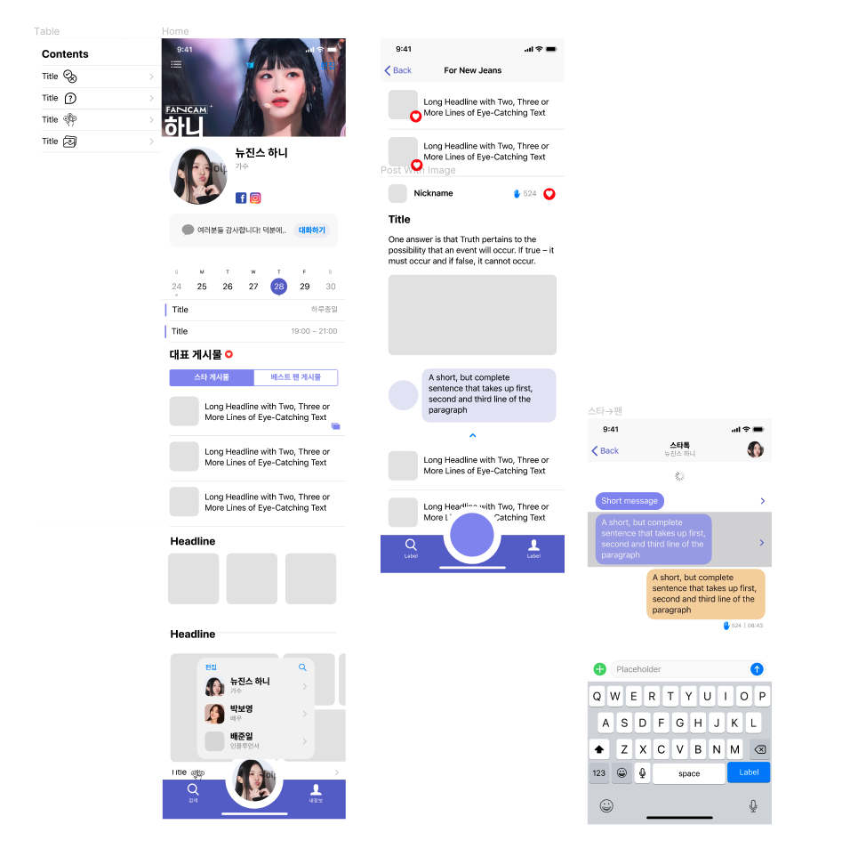
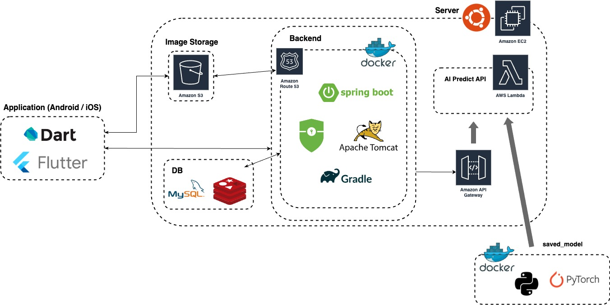

# 💜 NEO(Need Each Other)

#### - 간단 소개
> `NEO`는 `Need Each Other`로, 스타와 팬은 서로를 필요로 하는 관계에서 착안해 제작중인 서비스입니다. 스타의 일상을 공유하고, 자유와 제한을 통해 성숙한 소통을 할 수 있는 `스타페이지`, 팬들에게 질문해 가장 많이 공감하는 말을 들을 수 있는 `스타톡`, `암표걱정 없는 콘서트/팬미팅 예매 기능`을 목표로 제작중입니다.

#### - Dev Stack(상세 내용은 상단 카드를 눌러주세요.)

#### - 본인 성과(상세 내용은 상단 카드를 눌러주세요.)
- `DDD(Domain Driven Design)` 도입, `스타페이지`/`카테고리`/`포스트` 애그리거트 개발 : https://www.notion.so/codingleeseunghoon/NEO-82b16cbc7dc6494090bca419162fa420
- `Redis Cluster` 구축 경험 (Master 3 : Replica 3)
- `Docker-Compose`를 통한 개발환경 구축
- `Spring REST Docs`를 활용한 컨트롤러 테스트 기반 `API 문서` 작성 경험
- `Spirng Security + OAuth2 Client + JWT Token`을 활용한 소셜 로그인 구현

---
# 🧑🏻‍💻 제발모발(JBMB)

#### - 간단 소개
> `제발모발(JBMB)`은 `AI 이미지분석`를 활용한 탈모진단 서비스입니다.

#### - Dev Stack(상세 내용은 상단 카드를 눌러주세요.)

---

